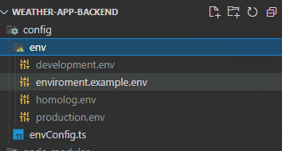
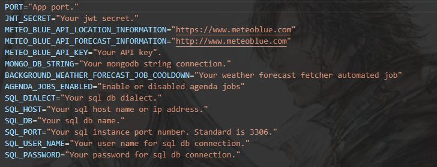
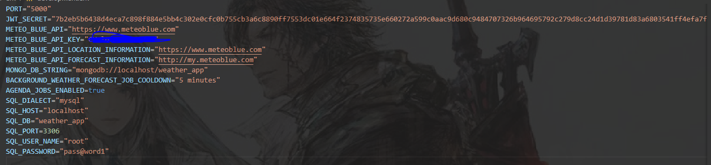
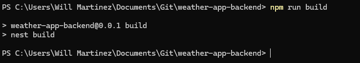
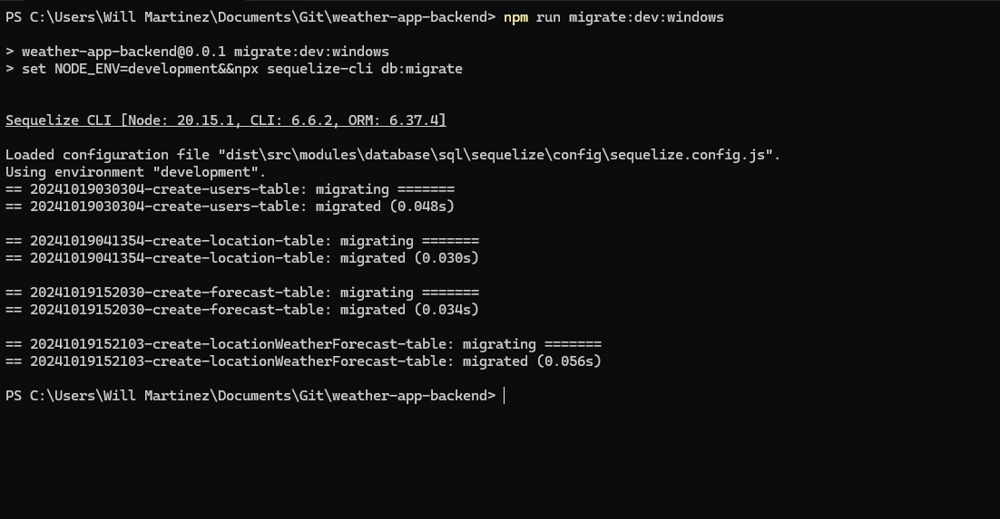
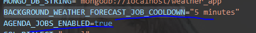
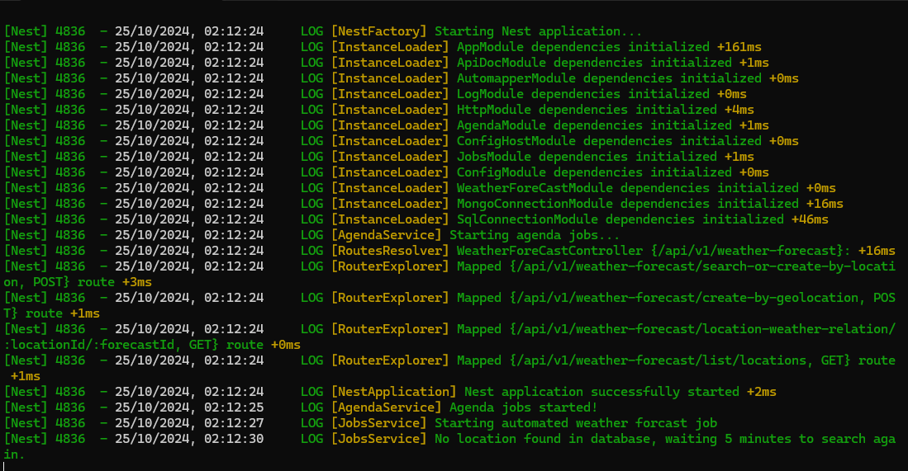
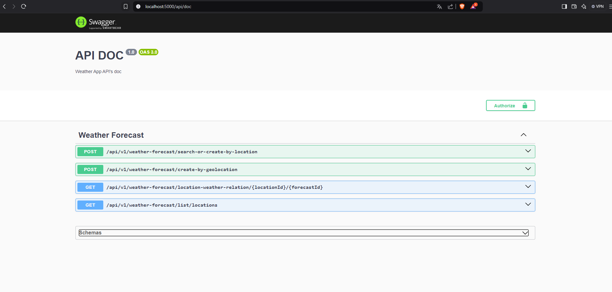
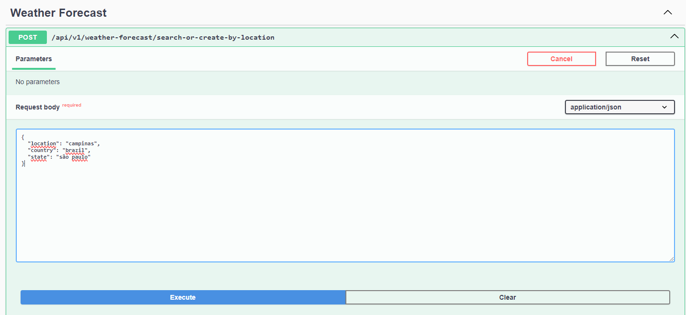

# Weather App Backend

## Descrição
Aplicação web para exibição de dados de previsão do tempo em diversas localidades através de geolocalização ou por nome de cidade, estado e país.

## Requisitos para iniciar o backend
- Nodejs (utilizado versão 20.15.1), MongoDB Community Server(Utilizado versão 8.0.1), MySQL Community Server(Versão utilizada 9.1.0)
- Segue links abaixo para instalação caso necessário:
    - Nodejs: https://nodejs.org/en/download/prebuilt-installer
    - MySQL: https://dev.mysql.com/downloads/mysql/
    - MongoDB: https://www.mongodb.com/try/download/community (usado para armazenar o registro de rotinas executadas pelo agendajs)

- Como ferramentas opcionais, pode instalar uma das opções de SGBD para os bancos de dados:
    - Mysql Workbench: https://dev.mysql.com/downloads/workbench/
    - MongoDB Compass: https://www.mongodb.com/try/download/compass

## Como inciar o backend
- Primeiro, é necessário configurar um arquivo de ambiente e obrigatoriamente, precisa ter o nome de development, production ou homolog(todos de extensão .env) conforme print abaixo:
  
    

- Em seguida, siga o exemplo que está dentro da pasta de env(enviroment.example.env) para montar as variáveis de ambiente. A única variável de ambiente não obrigatória
  para o pleno funcionamento da aplicação, é o JWT_SECRET(não na versão atual da aplicação).
    .

    como deve ficar seu arquivo de ambiente(mostrando development.env)
    .

- Lembre-se de colocar a sua API-KEY para consumir a API da MeteoBlue. Após essa configuração de variável de ambiente, é necessário criar um banco de dados local
  para o MySQL. O nome do banco de dados foi nomeado como weather_app, mas sinta-se a vontade em alterar este nome caso queira, apenas lembre-se que terá que atualizar 
  seu arquivo de variável de ambiente também.

- Uma vez criado o banco de dados MySQL de forma local(o que não precisa ser feito com o MongoDB), é possível executar o script de migrations para subir as tabelas
  no banco de dados criado. Primeiramente, faça o build da aplicação, executando o comando "npm run build".

  

- Após executar o build, certifique que na raiz do projeto, uma nova pasta apareceu com o nome de "dist". Ela é o código compilado de typescript para javascript
  cujo será executado pelo nodejs.

- Antes de executar a aplicação, É extremamente obrigatório que se use o comando via npm que se encontra no arquivo package.json, sendo ele o
  "npm run  migrate:dev:windows", ou se for o caso de você estar usando um sistema operacional de distribuição linux, execute "npm run migrate:dev:linux".
  Isso garante que a aplicação será executada em um abiente específico, junto com suas variáveis específicas dentro de um sistema operacional windows ou linux.

   

- A próxima etapa agora, é validar se a variável de ambiente para sua aplicação "AGENDA_JOBS_ENABLED" está com o valor de true para que a rotina de atualização
  de previsão do tempo para as localidades cadastradas no banco de dados, sejam executadas. Note que no arquivo de configuração das variáveis de ambiente, existe
  uma variável chamada "BACKGROUND_WEATHER_FORECAST_JOB_COOLDOWN". Seu valor define o intervalo de tempo que essa rotina será executada, por exemplo, "5 minutes" para 5 minutos, "20 minutes" pra 20 minutos, "24 hours" pra 24 horas e assim por diante. Caso precise consultar a documentação da biblioteca, veja no link https://github.com/agenda/agenda

  

- Para executar a aplicação, basta executar o comando de "npm run start:dev:windows" para que o backend faça a compilação do código e execute com o nodejs.
  Até o momento, todas as instruções foram passadas usando o ambiente de development, caso queira rodar em produção, deverá executar comando npm como
  "npm run migrate:prod:windows" ou "npm run start:prod:windows"(lembre-se sempre de criar os arquivos com os nomes corretos e as variaveis de ambiente).

  

## Documentação da API
- A aplicação possui uma documentação das API's, construida usando o swagger e está acessível na rota "/api/doc". Nessa rota, tem descrições
  de propriedades de request e response, exemplos de resposta e chamadas podem ser feitas nessa documentação.

  

  Exemplo de chamada de api:

  

  OBS: Os valores precisam ser em letras minúsculas
